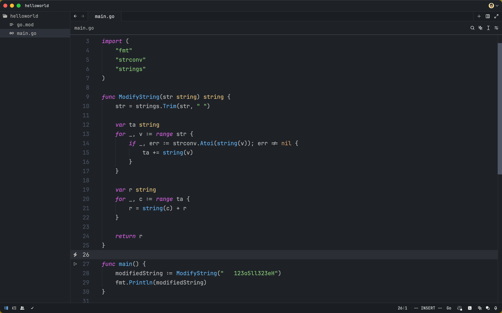

# Zed One Dark Vivid
One Dark Vivid theme for Zed, Ported from One Dark Pro

## Screenshots


## Installation
#### 1. Clone the repository
```bash
git clone https://github.com/xqsit94/zed-one-dark-vivid.git
cd zed-one-dark-vivid
```
#### 2. Copy theme to config directory
```bash
chmod +x install.sh
./install.sh
```
or
```bash
cp themes/one-dark-vivid.json ~/.config/zed/themes/
```
#### 3. Set the theme in Zed
- Open Zed
- `Cmd + Shift + P` to open command palette
- Choose `theme selector: toggle` and select `One Dark Vivid` to apply the theme

## Credits
- Original One Dark Pro theme for Zed by [Derrick Laird](https://github.com/MordFustang21/zed-one-dark-pro)
